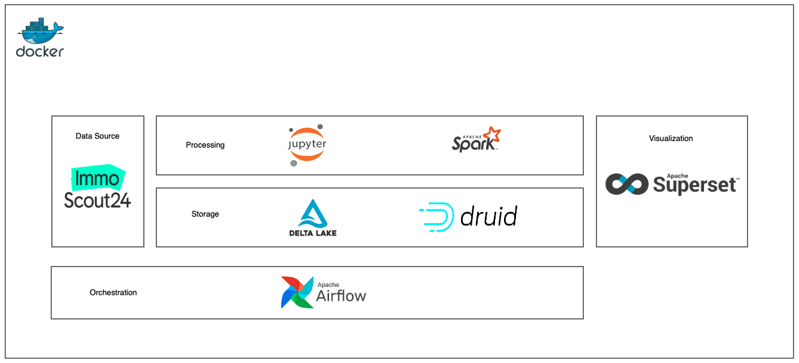
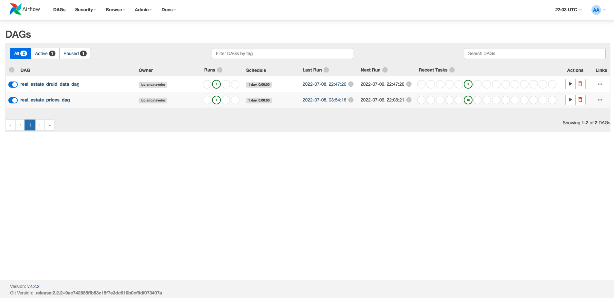
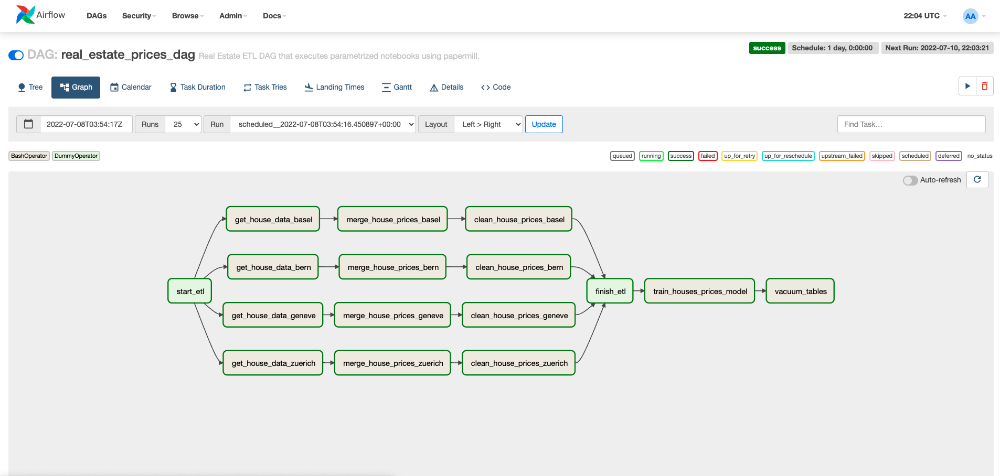
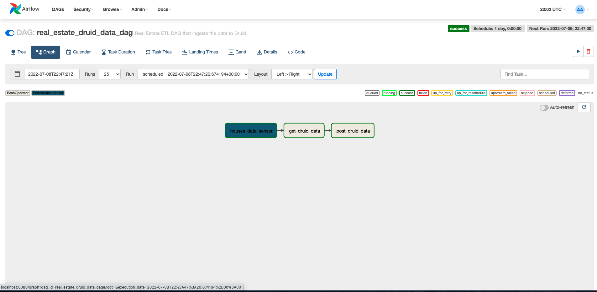
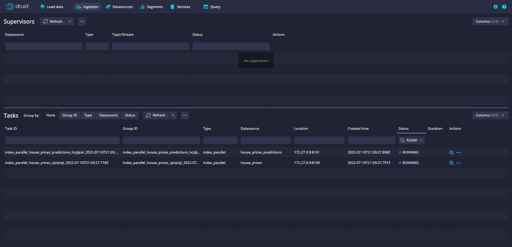
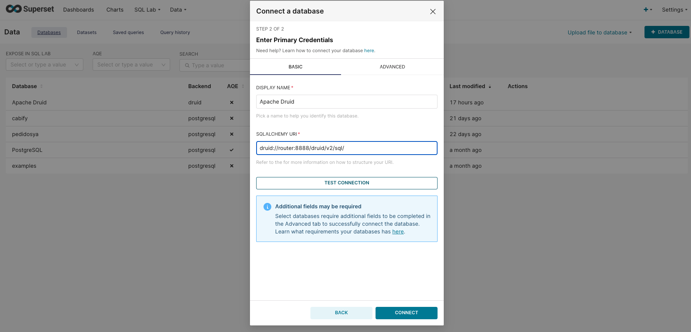
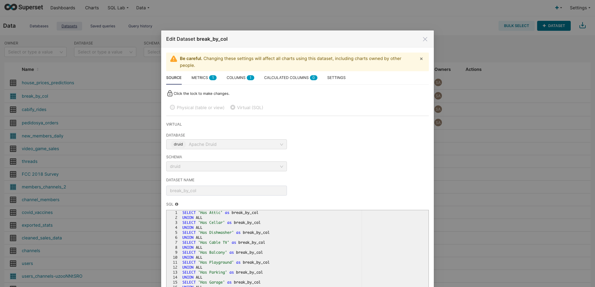
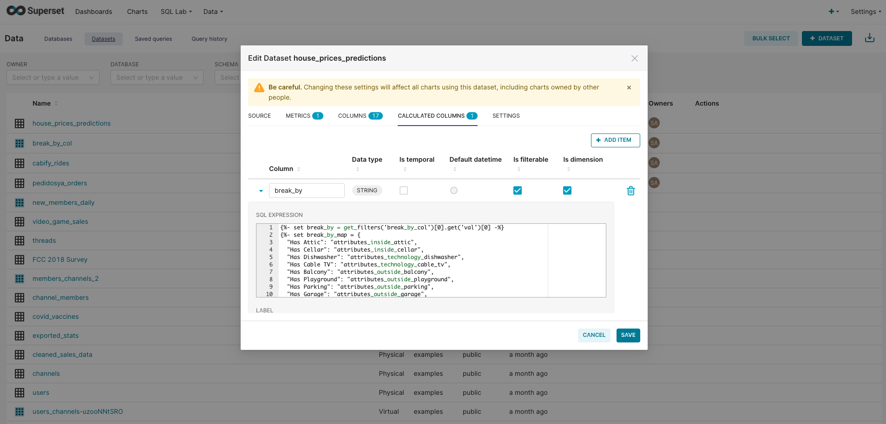
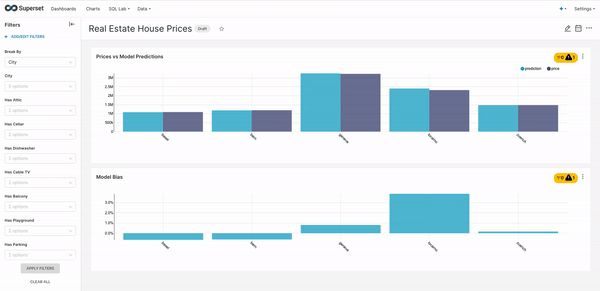

# Real Estate Prices ETL

[](https://airflow.apache.org/)
[](https://www.python.org/)
[](https://spark.apache.org/docs/latest/api/python/#)
[](https://delta.io/)
[](https://jupyter.org/)
[](https://papermill.readthedocs.io/en/latest/)
[](https://druid.apache.org/)
[](https://superset.apache.org/)
[](https://www.docker.com/)

The following project is based on [Building a Data Engineering Project in 20 Minutes](https://www.sspaeti.com/blog/data-engineering-project-in-twenty-minutes/), where the idea is to:
- build a scrapper to real estate data
- process the scrapped data using `PySpark` inside `Jupyter Notebooks`
- store the processed data on `delta` tables
- build a ML to predict the house prices
- ingest the predicted data to `Apache Druid`
- connect `Apache Superset` to the `Apache Druid` DB, and create a dashboard to keep track of the ML model performance
- orchestrate everything using `Apache Airflow` running inside `docker` containers

So, in summary, we want to build an ETL scrapping the prices and data from a web site, process that retrieved data to build a ML model, and create a dashboard to inspect the model performance.

## Immo Scout 24
To get the real estate prices and data, we re going to scrape [Immo Scout 24](https://www.immoscout24.ch/en) website, trying to retrieve the house description, with its price included. Then we are going to parse its description into a tabular format.


## Technologies Used
To achieve this, we are going to set up and use different technologies. As a main explanation, we are going to use `Docker` to spin up all the necessary containers to develop the infrastructure to run everything we need. 

So, by using `Docker`, we are going to spin up `Apache Airflow`, who is going to be in charge of orchesatrating all the tasks: such as executing `Jupyter Notebook` to scrape the web site, use `PySpark` to process and model the data. Then, spin up the necessary services to run `Apache Druid`, who `Apache Airflow` is in charge of ingesting the predicted data, from a `delta` table. And finally, spin up the necessary services to run `Apache Superset`, where we built a dashbaord, by connecting it to `Apache Druid` to keep track of the performance of the ML model, and having the ability to inspect the model by filtering and breaking by diferent dimensions.



### Docker
Docker is an open source containerization platform. It enables developers to package applications into containers—standardized executable components combining application source code with the operating system (OS) libraries and dependencies required to run that code in any environment.

Docker is essentially a toolkit that enables developers to build, deploy, run, update, and stop containers using simple commands and work-saving automation through a single API.

On the root directory of the project, you will find on the `docker-compose.yml` file, with the definition and configuration of all the services I am using to run the ETL. That `docker-compose.yml` file, also relies on `airflow.Dockerfile` and `jupyter.Dcokerfile`.

To start the services, I run the following commands:
```
$ echo -e "AIRFLOW_UID=$(id -u)\nAIRFLOW_GID=0" > .env
$ docker compose build
$ docker compose up airflow-init
$ docker compose up
```

This will spin up `Apache Airflow` on `localhost:8080`. We should use *Airflow* both as user and password.

Also, it will spin up a `Jupyter Notebook` server on the port `8887` (I am not using the typical `8888`, since it is going to be used by `Apache Druid` in a bit), also with `PySpark` installed, in case we want to run manually some of the notebooks, that are then going to be triggered by `Apache Airflow`. 

To get the proper URL with the token, we can run:
```
$ docker logs real-estate-prices_jupyter_1
```

### Apache Airflow
`Apache Airflow` is an open-source tool to programmatically author, schedule, and monitor workflows. It is one of the most robust platforms used by Data Engineers for orchestrating workflows or pipelines. You can easily visualize your data pipelines’ dependencies, progress, logs, code, trigger tasks, and success status.

With `Apache Airflow`, users can author workflows as Directed Acyclic Graphs (DAGs) of tasks. `Apache Airflow`’s rich user interface makes it easy to visualize pipelines running in production, monitor progress, and troubleshoot issues when needed. It connects with multiple data sources and can send an alert via email or Slack when a task completes or fails. `Apache Airflow` is distributed, scalable, and flexible, making it well suited to handle the orchestration of complex business logic.

Once on `localhost:8080`, we will see both DAGs.



When checking `real_estate_prices_dag`, we find the following diagram:



After running the `real_estate_prices_dag` DAG, we will have already scrapped the real estate data from a bunch of different cities, stored the raw data on `/data_lake/bronze/house_prices_raw/` directory, processed the data and create the `/data_lake/golden/house_prices/` table. 

Also, we trained a ML model using `PySpark MLLib` librray, using the `/data_lake/golden/house_prices/` table, and creating the final `/data_lake/golden/house_prices_predictions/` table.



The `real_estate_druid_data_dag` DAG has a sensor to the previous one. So, once `real_estate_prices_dag` is over, this DAG is in charge of ingesting `/data_lake/golden/house_prices/` and `/data_lake/golden/house_prices_predictions/` tables to `Apache Druid`. So once this DAG is complete, `Apache Druid` will have all the update data.

### Jupyter Notebooks
As a data scientist, it is super common to work with some kind of notebook environment; which combines live code, equations, narrative text, visualizations, interactive dashboards and other media. Also, it provides in-line code execution using blocks, so it is quite fast to test minimal things and prototype some code. 

Here is where `Jupyter Notebooks` come to play: it is an open-source IDE that is used to create Jupyter documents that can be created and shared with live codes. Also, it is a web-based interactive computational environment.

As I told, data scientist are very used to use this kind of IDEs, so here the idea is to create the minimal friction between prototyping and testing, and implementing on production. The idea of this whole project is to create the minimum overhead between developing and production ready code.

On this project, `Apache Airflow` will execute the defined notebooks, which contains the scrapping, transformation and modeling tasks. You can find the notebooks used on `notebooks/input/` directory. 

There you are going to find the following:
- `get_houses_data.ipynb`: this one is the one in charge of scrapping the website and staoring all the parsed data in `/data_lake/brozen/house_prices_raw/` directory.

- `merged_data.ipynb`: this one is in charge of creating an `UPSERT` on our intermediate table. It is common for the same house to change its price, or a feature after it has been posted. So here we INSERT the new houses, and UPDATE the old ones

- `create_golden_table.ipynb`: this one is the responsible of cleaning our intermediate table, and storing the cleaned version on `/data_lake/golden/house_prices/`

- `house_prices_model.ipynb`: here we apply a Linera Regression over the house prices, to fit a model. We store the trained model on `model/artifacts/model` and the model predictions on the delta `/data_lake/golden/house_prices_predictions/` table.

- `get_druid_data.ipynb`: transoforms the golden delta tables, to `csv` files, suited to be used on `Apache Druid`.

- `post_druid_data.ipynb`: posts the data as ingestion tasks on `Apache Druid`

### Papermill
As we can see, all our process is defined on independent notebooks. But some of these ones, are exactly the same, but uses different values (such as the city to scrape). 

In order to not repeat the exact same notebook and having to maintain quite similar noteboks, for each task, we want to parametrize the notebook, and to be flexible to different inputs.

Here is where we introduce `Papermill`. `Papermill` is a tool for parameterizing, executing, and analyzing Jupyter Notebooks. `Papermill` lets you parametrize and execute notebooks from the CLI.

The only change we ned to do, is to add `parameters` as a tag on the notebook. 

On this project, we are running each notebook using `papermill`, inside the `Apache Airflow` tasks. 

For example, we can see the command that it is called when running `get_houses_data.ipynb` for a particular city:

```
papermill /opt/notebooks/input/get_houses_data.ipynb /opt/notebooks/output/get_houses_data_output.ipynb -p date 2022-07-09 -p city bern -p radius 40
```

So, we are executing `get_houses_data.ipynb` with three parameters values:
- `date`: `2022-07-09`
- `city`: `bern`
- `radius`: `40`

It is quite clear how we can change the `city` value, and execute the exact same notebook with a different parameter.

### PySpark
As I already commented, all the data processing is developed using `PySpark` inside the `Jupyter Notebooks`, which is Python's interface to `Apache Spark`.

`Apache Spark` is an open-source, distributed processing system used for big data workloads. It utilizes in-memory caching, and optimized query execution for fast analytic queries against data of any size. It provides development APIs in Java, Scala, Python and R, and supports code reuse across multiple workloads—batch processing, interactive queries, real-time analytics, machine learning, and graph processing

On this project, we are heavily relying on the `PySpark` DataFrames, which A distributed collection of data grouped into named columns. It can also be seen as tables that consist of rows and columns of data. It has a two-dimensional structure wherein every column consists of values of a particular variable while each row consists of a single set of values from each column.

Also, to train the Logistic Regression, we are using `MLlib` module which is built on top of `Apache Spark`. It is a scalable machine learning library that provides a uniform set of high-level APIs that help users create and tune practical machine learning pipelines.

### Delta
As we already saw, our data is stored in `delta tables`. 
But why using this format instead of `parquet` and `ORC tables`, since they also work with `PySpark`?

`Delta` comes to solve some limitations `ORC tables` presents, and enables permorming ACID operations to distributed data.

So, with `Delta` tables, we have the:

- ability to read consistent data while data is being written, by generaing snaphsot isoloation between writers and readers.

- ability to read incrementally from a large table with good throughput

- ability to rollback in case of bad writes

- ability to evolve the table schema: we can write data with new columns, without havin to first adapt the schema

- Full DML Support: `Delta Lake` supports standard DML including `UPDATE`, `DELETE` and `MERGE INTO` providing developers more controls to manage their big datasets.

As we can see, we have full flexibility on a Big Data environment.

A beautiful feature of `Delta` tables is that on of `MERGE INTO`. With that command is super easy to make `UPSERTS` on the table. Here is how we use it on this project, to update already present houses IDs on our table, and insert all the new values:

```
(
    silver_table
    .alias("silver_table")
    .merge(daily_data.alias("daily_data"),
           "silver_table.property_id=daily_data.property_id and silver_table.city=daily_data.city")
    .whenMatchedUpdateAll()
    .whenNotMatchedInsertAll()
    .execute()
)
```

`Delta` also has a convention on how to structure the data lake. It recommends splitting the directory in:
- **bronze**: Read raw data from Parquet files using Spark, save data in Delta Lake Bronze table

- **silver**: Perform ETL to clean and conform our data, saving the result as a Silver table

- **gold**: Load the Silver table, then narrow it down to fit our specific use case, saving the result as a Gold table

### Apache Druid
`Apache Druid` is a real-time analytics database designed for fast slice-and-dice analytics ("OLAP" queries) on large data sets. Most often, `Apache Druid` powers use cases where real-time ingestion, fast query performance, and high uptime are important.

`Apache Druid` is commonly used as the database backend for GUIs of analytical applications, or for highly-concurrent APIs that need fast aggregations. `Apache Druid` works best with event-oriented data.

Common application areas for `Apache Druid` include:

- Clickstream analytics including web and mobile analytics
- Network telemetry analytics including network performance monitoring
- Server metrics storage
- Supply chain analytics including manufacturing metrics
- Application performance metrics
- Digital marketing/advertising analytics
- Business intelligence/OLAP

#### Key features of Druid
Druid's core architecture combines ideas from data warehouses, timeseries databases, and logsearch systems. Some of Druid's key features are:
- **Columnar storage format**. Druid uses column-oriented storage. This means it only loads the exact columns needed for a particular query. This greatly improves speed for queries that retrieve only a few columns. Additionally, to support fast scans and aggregations, Druid optimizes column storage for each column according to its data type.

- **Scalable distributed system**. Typical Druid deployments span clusters ranging from tens to hundreds of servers. Druid can ingest data at the rate of millions of records per second while retaining trillions of records and maintaining query latencies ranging from the sub-second to a few seconds.

- **Massively parallel processing**. Druid can process each query in parallel across the entire cluster.

- **Realtime or batch ingestion**. Druid can ingest data either real-time or in batches. Ingested data is immediately available for querying.

- **Self-healing, self-balancing, easy to operate**. As an operator, you add servers to scale out or remove servers to scale down. The Druid cluster re-balances itself automatically in the background without any downtime. If a Druid server fails, the system automatically routes data around the damage until the server can be replaced. Druid is designed to run continuously without planned downtime for any reason. This is true for configuration changes and software updates.

- **Cloud-native, fault-tolerant architecture that won't lose data**. After ingestion, Druid safely stores a copy of your data in deep storage. Deep storage is typically cloud storage, HDFS, or a shared filesystem. You can recover your data from deep storage even in the unlikely case that all Druid servers fail. For a limited failure that affects only a few Druid servers, replication ensures that queries are still possible during system recoveries.

- **Indexes for quick filtering**. Druid uses Roaring or CONCISE compressed bitmap indexes to create indexes to enable fast filtering and searching across multiple columns.

- **Time-based partitioning**. Druid first partitions data by time. You can optionally implement additional partitioning based upon other fields. Time-based queries only access the partitions that match the time range of the query which leads to significant performance improvements.

- **Approximate algorithms**. Druid includes algorithms for approximate count-distinct, approximate ranking, and computation of approximate histograms and quantiles. These algorithms offer bounded memory usage and are often substantially faster than exact computations. For situations where accuracy is more important than speed, Druid also offers exact count-distinct and exact ranking.

- **Automatic summarization at ingest time**. Druid optionally supports data summarization at ingestion time. This summarization partially pre-aggregates your data, potentially leading to significant cost savings and performance boosts.

To spin up `Apache Druid`, we are going to use the official `Docker` images from its [source code](https://github.com/apache/druid.git). 

Once cloned, we should make a minor change on the `distribution/docker/docker-compose.yml` to enable `Apache Druid` running on the same network everything else:
```
networks:
  default:
    external: true
    name: real-estate-prices_default
```

Now we can execute the following to have `Apache Druid` running:

```
$ cd druid
$ docker build -t apache/druid:tag -f distribution/docker/Dockerfile .
$ docker-compose -f distribution/docker/docker-compose.yml up
```
Once running, we can enter the dashboard on `localhost:8888`. 

As I already mentioned, `Apache Airflow` has a DAG which is in charge of ingesting the data to `Apache Druid`. Here is an example of the definition we `POST` on `Apache Druid`'s endpoint to ingest the `house_prices_predictions` table.

```
{
  "type": "index_parallel",
  "spec": {
    "ioConfig": {
      "type": "index_parallel",
      "inputSource": {
        "type": "local",
        "baseDir": "/opt/data/golden/druid/house_prices_predictions",
        "filter": "*.csv"
      },
      "inputFormat": {
        "type": "tsv",
        "findColumnsFromHeader": false,
        "columns": [
          "property_id",
          "city",
          "attributes_inside_attic",
          "attributes_inside_cellar",
          "attributes_technology_dishwasher",
          "attributes_technology_cable_tv",
          "attributes_outside_balcony",
          "attributes_outside_playground",
          "attributes_outside_parking",
          "attributes_outside_garage",
          "number_of_rooms",
          "surface_property",
          "surface_usable",
          "surface_living",
          "normalized_price",
          "prediction"
        ]
      }
    },
    "tuningConfig": {
      "type": "index_parallel",
      "partitionsSpec": {
        "type": "dynamic"
      }
    },
    "dataSchema": {
      "dataSource": "house_prices_predictions",
      "timestampSpec": {
        "column": "!!!_no_such_column_!!!",
        "missingValue": "2010-01-01T00:00:00Z"
      },
      "dimensionsSpec": {
        "dimensions": [
          {
            "type": "long",
            "name": "property_id"
          },
          "city",
          {
            "type": "long",
            "name": "attributes_inside_attic"
          },
          {
            "type": "long",
            "name": "attributes_inside_cellar"
          },
          {
            "type": "long",
            "name": "attributes_technology_dishwasher"
          },
          {
            "type": "long",
            "name": "attributes_technology_cable_tv"
          },
          {
            "type": "long",
            "name": "attributes_outside_balcony"
          },
          {
            "type": "long",
            "name": "attributes_outside_playground"
          },
          {
            "type": "long",
            "name": "attributes_outside_parking"
          },
          {
            "type": "long",
            "name": "attributes_outside_garage"
          },
          {
            "type": "double",
            "name": "number_of_rooms"
          },
          {
            "type": "long",
            "name": "surface_property"
          },
          {
            "type": "long",
            "name": "surface_usable"
          },
          {
            "type": "long",
            "name": "surface_living"
          },
          {
            "type": "long",
            "name": "normalized_price"
          },
          {
            "type": "double",
            "name": "prediction"
          }
        ]
      },
      "granularitySpec": {
        "queryGranularity": "none",
        "rollup": false,
        "segmentGranularity": "hour"
      }
    }
  }
}
```

Once the inhestion is running, we can see it on `Apache Druid` dashboard



### Apache Superset
`Apache Superset` is a modern, enterprise-ready business intelligence web application. It is fast, lightweight, intuitive, and loaded with options that make it easy for users of all skill sets to explore and visualize their data, from simple pie charts to highly detailed deck.gl geospatial charts.

`Apache Superset` is cloud-native and designed to be highly available. It was designed to scale out to large, distributed environments and works very well inside containers. While you can easily test drive `Apache Superset` on a modest setup or simply on your laptop, there’s virtually no limit around scaling out the platform.

`Apache Superset` provides:
- An intuitive interface for visualizing datasets and crafting interactive dashboards
- A wide array of beautiful visualizations to showcase your data
- Code-free visualization builder to extract and present datasets
- A world-class SQL IDE for preparing data for visualization, including a rich metadata browser
- A lightweight semantic layer which empowers data analysts to quickly define custom dimensions and metrics
- Out-of-the-box support for most SQL-speaking databases
- Seamless, in-memory asynchronous caching and queries
- An extensible security model that allows configuration of very intricate rules on on who can access which product features and datasets.
- Integration with major authentication backends (database, OpenID, LDAP, OAuth, REMOTE_USER, etc)
- The ability to add custom visualization plugins
- An API for programmatic customization
- A cloud-native architecture designed from the ground up for scale

Once we have the data ingested on `Apache Druid`, we can spin up `Apache Superset` and create a dahsboard to keep track of the house prices ML model fitted on the DAG.

To build `Apache Superset`, I am going to use the official `docker-compose-non-dev.yml`, which you can find on the `superset` directory. 

We should make a minor change on some of those files. First, make `Apache Superset` run on the same network everything else is running, by adding this definition on the `docker-compose-non-dev.yml` file:
```
networks:
  default:
    external: true
    name: real-estate-prices_default
```

And also, adding the following on the `docker/pythonpath_dev/superset_config.py` file, to enable using Jinja to parametrize the queries we will create on our `Real Estate House Prices` Dashboard.
```
FEATURE_FLAGS = {
    ...  # your existing flags
    "ENABLE_TEMPLATE_PROCESSING": True,
}
```

To build `Apache Superset`, I am going to use the official `docker-compose-non-dev.yml`, which you can find on tghe `superset` directory

```
$ cd superset
$ docker-compose -f docker-compose-non-dev.yml up
```
This will spin up `Apache Superset` on `localhost:8088`. We should access using *admin* both as user and password.

Now, we can connect `Apache Superset` to the `Apache Druid` database



Also, we will create a new dataset to enable breaking by dfined columns the Dashboard we are going to create



And now, we should create a custom dimension on our `Apache Druid` dataset, to react to the selection of the breaking by dimension. We will create a dimension with the following SQL definition:
```


{{ break_by_map.get(break_by, break_by) }}

```




Now, we are in condition to create the following dashbaord:


